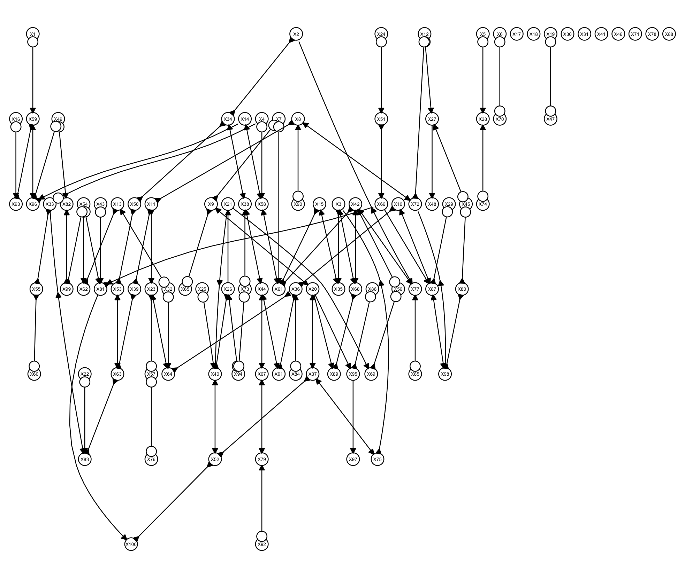

ReadMe
================
2026-03-14

# PFCI: Penalized Fast Causal Inference for High-Dimensional Structure Learning

PFCI implements **Penalized Fast Causal Inference (PFCI)**, a scalable
two-stage procedure for learning graphical structures in
high-dimensional settings with potential latent variables and selection
bias.

The method combines:

- **Graphical lasso screening** to obtain a sparse super-skeleton  
- **Constrained Fast Causal Inference (FCI)** for orientation and
  refinement

This enables computationally efficient structure learning while
preserving theoretical guarantees under sparsity assumptions.

------------------------------------------------------------------------

## 📦 Installation

``` r
```r
# run this once
install.packages("BiocManager")
BiocManager::install(c("graph","RBGL","Rgraphviz","ggm","pcalg"))
```

Install the development version from GitHub:

``` r
options(repos = c(CRAN = "https://cloud.r-project.org"))
# install.packages("devtools")
devtools::install_github("SamhitaPal3/PFCI")

library(PFCI)

sim <- simulate_pfci_toy()
fit <- pfci_fit(sim$X)
met <- pfci_metrics(sim, fit)
met
```

    ## $SHD
    ## [1] 34
    ## 
    ## $F1_total
    ## [1] 0.8365385
    ## 
    ## $MCC
    ## [1] 0.8336793
    ## 
    ## $Precision
    ## [1] 0.87
    ## 
    ## $Recall
    ## [1] 0.8055556
    ## 
    ## $TP
    ## [1] 87
    ## 
    ## $FP
    ## [1] 13
    ## 
    ## $FN
    ## [1] 21
    ## 
    ## $TN
    ## [1] 4829
    ## 
    ## $Time
    ## [1] 0.150439
    ## 
    ## $rho
    ## [1] 0.1617968

``` r
plot_pag(fit)
```

<!-- -->

# Reference

Pal, S., Ghosh, D., & Yang, S. (2025). Penalized FCI for Causal
Structure Learning in a Sparse DAG for Biomarker Discovery in
Parkinson’s Disease. arXiv preprint arXiv:2507.00173.
